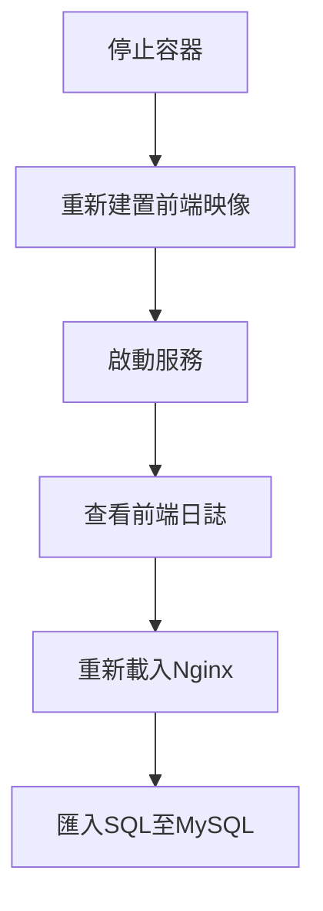

# 🐳 Docker 專案重建與維護流程指令教學

這份筆記整理了專案在 Docker 環境下從 **關閉 → 重建 → 啟動 → 驗證** 的完整流程，包括重新載入 Nginx、執行資料庫匯入等日常維護動作。

---

## 🧹 1️⃣ 停止並移除現有容器
```bash
sudo docker compose down
```
**說明：**  
停止所有正在執行的容器，並移除相關網路與暫存設定。  
> ✅ 用途：清除舊環境，避免版本或快取干擾。

---

## 🧱 2️⃣ 重新建置前端映像（不使用快取）
```bash
sudo docker compose build --no-cache frontend
```
**說明：**  
針對 `frontend` 服務進行全新建置，不使用舊的快取層。  
> ✅ 用途：當 `Dockerfile`、`package.json`、或 `.env` 有更新時強制重建。

---

## 🚀 3️⃣ 啟動所有服務容器
```bash
sudo docker compose up -d
```
**說明：**  
以背景模式啟動所有在 `docker-compose.yml` 中定義的服務（例如前端、後端、MySQL、Nginx 等）。  
> ✅ 用途：讓整個應用進入執行狀態。
## Docker常用指令
---

## 📜 4️⃣ 查看前端執行日誌
```bash
sudo docker logs -f dev-frontend
```
**說明：**  
即時查看 `dev-frontend` 容器輸出的日誌資訊。  
> ✅ 用途：監控前端啟動進度或 API 呼叫是否成功。  
> ⌨️ 按 `Ctrl + C` 可中斷監看。

---

## 🔁 5️⃣ 重新載入 Nginx 設定（不中斷服務）
```bash
sudo docker exec -it dev-nginx nginx -s reload
```
**說明：**  
在 `dev-nginx` 容器內重新載入 Nginx 設定檔。  
> ✅ 用途：修改 `/etc/nginx/nginx.conf` 或 `/etc/nginx/conf.d/*.conf` 後使用此指令套用變更，不需重啟整個容器。  

---

## 💾 6️⃣ 匯入 SQL 檔案至 MySQL 容器
```bash
sudo docker exec -i dev-mysql mysql -u root -ppassword remote_api_manager_macuhau < /home/heroic/projects/lang-exam/deployment/db/version-1.0.0/dump.sql
```
**說明：**  
將本機 SQL 檔案匯入至 MySQL 容器中的指定資料庫。  
- `dev-mysql`：容器名稱  
- `-u root -ppassword`：資料庫登入帳號與密碼  
- `remote_api_manager_macuhau`：目標資料庫名稱  
- `< .../dump.sql`：指定要匯入的 SQL 檔路徑  

> ✅ 用途：快速初始化資料庫或導入新版本結構。  
> ⚠️ 注意：請確保該資料庫已存在，或事先在容器中建立。

---

## 💡 7️⃣ 其他常用指令

| 動作 | 指令 |
|------|------|
| 查看所有容器狀態 | `sudo docker ps` |
| 進入容器互動模式 | `sudo docker exec -it dev-frontend /bin/sh` |
| 重新啟動單一服務 | `sudo docker compose restart frontend` |
| 查看 MySQL 日誌 | `sudo docker logs dev-mysql` |

---

## 🔄 完整流程圖


